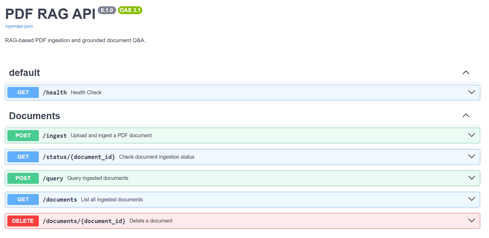
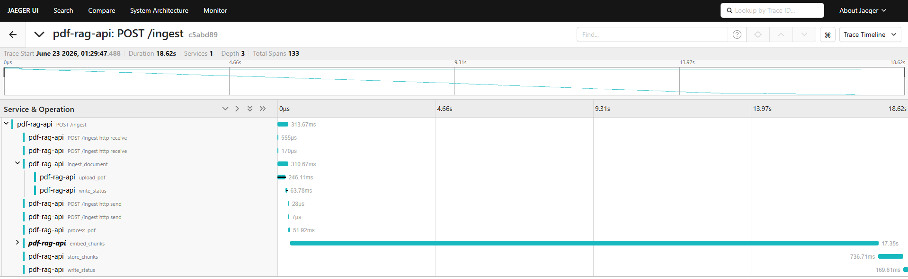
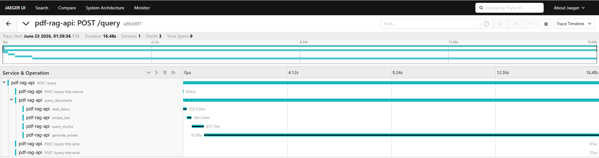
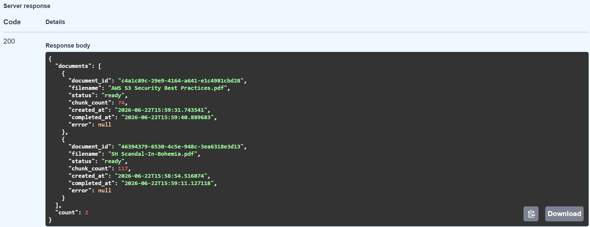
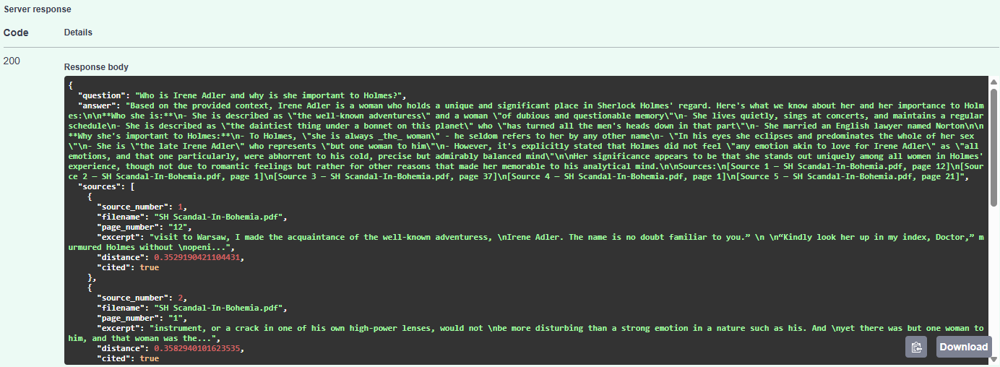
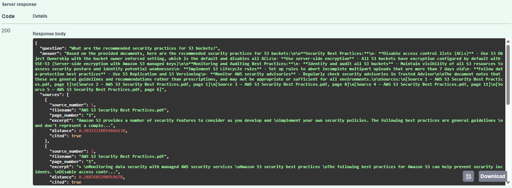
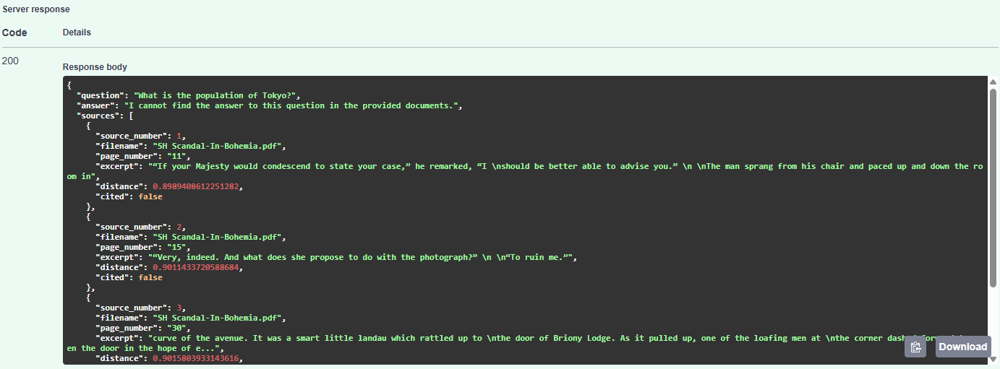

# pdf-rag-api

A REST API for PDF document ingestion and grounded question answering. Upload PDFs, ask natural language questions, and get answers grounded strictly in the document content with page-level citations.

Built with FastAPI, AWS Bedrock, and AWS S3 Vectors. Every request is traced end-to-end with OpenTelemetry.

## What It Does

- **Ingest** - Upload a PDF via POST /ingest. The API stores it in S3, extracts text page by page, chunks it with recursive character splitting, embeds each chunk using Amazon Titan Text v2, and indexes the vectors in AWS S3 Vectors. Returns a document_id immediately while processing continues in the background.

- **Query** - Ask a natural language question via POST /query. The API embeds the question, retrieves the most semantically similar chunks from S3 Vectors, and generates a grounded answer using Claude Sonnet via AWS Bedrock. Answers include page-level citations and a cited flag per source showing which chunks Claude actually used.

- **Manage** - List all ingested documents, check ingestion status, and delete documents with full cleanup across S3 and S3 Vectors.

## Tech Stack

| Layer | Technology |
|---|---|
| API Framework | FastAPI - async endpoints, background tasks, dependency injection |
| LLM | AWS Bedrock - Claude Sonnet 4 |
| Embeddings | AWS Bedrock - Amazon Titan Text v2 (1024 dimensions) |
| Vector Store | AWS S3 Vectors - cosine similarity, metadata filtering |
| Document Storage | AWS S3 |
| PDF Processing | PyMuPDF |
| Text Splitting | LangChain RecursiveCharacterTextSplitter |
| Observability | OpenTelemetry SDK + Jaeger (OTLP gRPC export) |
| Infrastructure | Terraform |
| CI | GitHub Actions |
| Containerization | Docker + Docker Compose |

## API Endpoints

| Method | Endpoint | Description |
|---|---|---|
| POST | /ingest | Upload a PDF for background ingestion. Returns document_id immediately. |
| GET | /status/{document_id} | Check ingestion status - processing, ready, or failed. |
| POST | /query | Ask a question. Returns grounded answer with page citations. |
| GET | /documents | List all ingested documents with status and metadata. |
| DELETE | /documents/{document_id} | Delete document and all associated vectors from S3 Vectors. |
| GET | /health | Health check. |

## Screenshots

### API Endpoints

### Ingestion Pipeline - OpenTelemetry Trace
Full ingestion pipeline traced end-to-end. Client receives 202 immediately while background processing continues. The embed_chunks span clearly dominates - expected since each chunk requires a separate Bedrock API call.

### Query Pipeline - OpenTelemetry Trace
Query pipeline showing embed_text, query_chunks, and generate_answer spans.

### Ingested Documents List

### Query with Page Citations # Example 1

### Query with Page Citations # Example 2

### Query - Grounding Working
When the answer is not in the provided documents the system returns a fixed refusal message rather than hallucinating from training data.

## Getting Started

### Prerequisites

- Docker Desktop
- AWS account with Bedrock, S3, and S3 Vectors access
- Terraform
- AWS CLI configured with SSO or IAM credentials

### 1. Provision AWS Resources

Copy the example and fill in your values:

    cd terraform
    cp terraform.tfvars.example terraform.tfvars

Then run:

    terraform init
    terraform apply

### 2. Configure Environment

    cp .env.example .env

Fill in your AWS credentials and the bucket names from Terraform output.

### 3. Run

    docker compose up -d

- API: http://localhost:8000
- Swagger UI: http://localhost:8000/docs
- Jaeger UI: http://localhost:16686

### 4. Ingest a Document

Upload a PDF via Swagger UI at POST /ingest. Copy the returned document_id.

Poll GET /status/{document_id} until status is ready.

### 5. Query

Send a POST /query request with your question, and optionally a document_id to scope the search to a specific document.

## How It Works

### Chunking

PDFs are processed page by page using PyMuPDF. Each page's text is split using recursive character splitting with a 512-character chunk size and 50-character overlap. The splitter prefers paragraph boundaries, then sentences, then words - never cutting mid-word.

Each chunk stores its source page number so citations point to the exact page the answer came from. Image-based PDFs are detected by average character count per page and rejected with a clear error message.

### Retrieval

Questions are embedded with the same Titan Text v2 model used at ingestion time. Cosine similarity search against S3 Vectors returns the top-k most relevant chunks. Queries can be scoped to a specific document via document_id or run globally across all ingested documents.

### Generation

Retrieved chunks are formatted as labeled context blocks with source labels including filename and page number. Claude Sonnet is instructed to answer only from the provided context and list all cited sources at the end. Citation extraction identifies which sources Claude actually used, populating the cited flag per source in the response.

### Grounding

If no chunks are retrieved, or if the answer is not in the context, the system returns a fixed refusal message rather than generating from Claude's training data. Temperature is set to 0.0 for deterministic, factual responses.

## Observability

Every request is traced end-to-end with OpenTelemetry. Spans are exported to Jaeger via OTLP gRPC. Run Jaeger locally via Docker Compose and open http://localhost:16686 to explore traces.

Key spans instrumented:

- ingest_document - full ingestion request with file size
- upload_pdf - S3 upload timing
- process_pdf - PDF extraction and chunking with page and chunk counts
- embed_chunks - batch embedding with total chunk count
- store_chunks - S3 Vectors storage with batch count
- query_documents - full query request with retrieved chunk count
- embed_text - question embedding
- query_chunks - vector similarity search
- generate_answer - Claude generation with chunk and citation counts

## Running Tests

    pytest tests/ -v

Tests covering chunking logic, citation extraction, context building, and route validation with mocked AWS dependencies.

## Known Limitations

- **Image-based PDFs not supported** - scanned documents require OCR. Detected and rejected with a clear error message. Tesseract integration is a natural next step.
- **No authentication** - the API has no auth layer. Add OAuth2 or API key middleware for any public deployment.
- **No document deduplication** - uploading the same file twice creates two independent documents. Content-hash based deduplication is a natural extension.
- **Jaeger in-memory storage** - traces are lost on container restart. Configure a persistent backend such as Elasticsearch for production use.
- **Chunking strategy** - recursive character splitting is pragmatic but not optimal. Semantic chunking would improve answer quality for complex documents.
- **No reindexing** - changing chunking parameters or the embedding model requires deleting and re-uploading the document. There is no update or reindex endpoint.

## Required AWS Permissions

Your AWS credentials need the following permissions:

S3:
- s3:PutObject
- s3:GetObject
- s3:DeleteObject
- s3:ListBucket

S3 Vectors:
- s3vectors:PutVectors
- s3vectors:QueryVectors
- s3vectors:DeleteVectors
- s3vectors:CreateIndex
- s3vectors:CreateVectorBucket
- s3vectors:DeleteIndex
- s3vectors:DeleteVectorBucket
- s3vectors:ListIndexes

Bedrock:
- bedrock:InvokeModel for Amazon Titan Text v2
- bedrock:InvokeModel for Anthropic Claude Sonnet